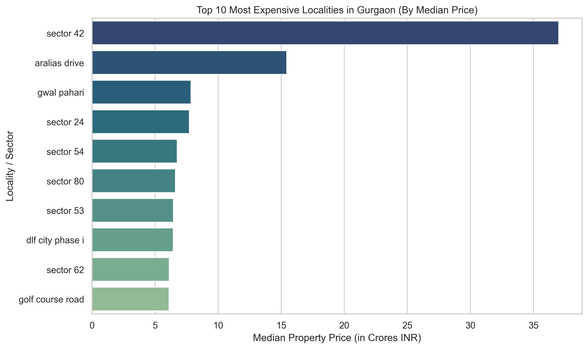
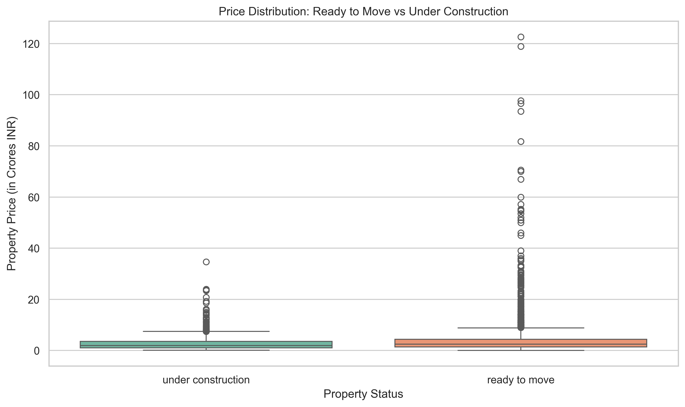
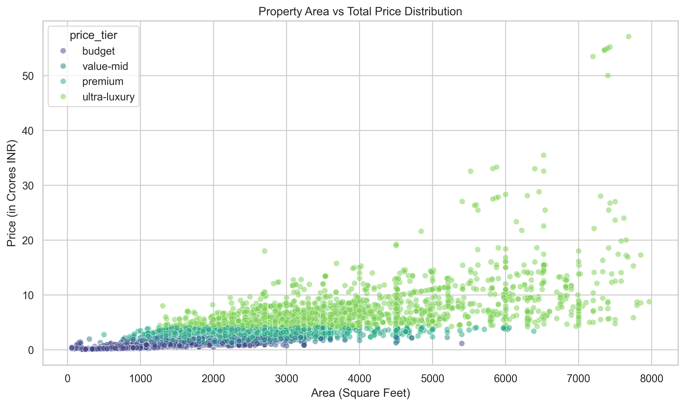
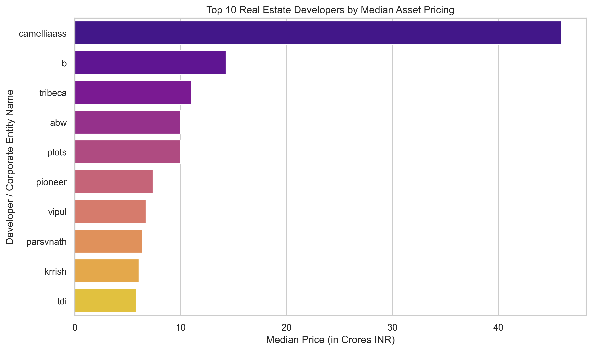

## Visualizations

### Top 10 Expensive Localities



### Ready to Move vs Under Construction



### Area vs Price Distribution



### Top Developers by Median Price



# Gurgaon Real Estate Market Analysis

## Project Overview

This Python project analyzes Gurgaon residential real estate listings. The objective was to clean scraped marketplace data, remove inconsistencies, engineer useful features, and identify pricing trends across localities, property types, RERA approval status, construction status, and luxury segments.

## Business Problem

Real estate advisors need clean market intelligence to understand pricing, location premiums, demand patterns, and investment opportunities. This project answers:

- Which localities command the highest median prices?
- Which areas have the highest rate per square foot?
- Do RERA-approved properties have a price premium?
- Do ready-to-move properties cost more than under-construction properties?
- Which developers or builders price higher?
- Which sectors have the highest ultra-luxury concentration?

## Dataset

- Raw dataset: 19,515 scraped property listings
- Cleaned dataset: 8,024 analysis-ready records

Key fields:

- Price
- Status
- Area
- Rate per sqft
- Property Type
- Locality
- Builder Name
- RERA Approval
- BHK Count
- Society
- Company Name
- Flat Type
- Price Tier
- Price in Crores

## Tools Used

- Python
- Pandas
- NumPy
- Matplotlib
- Seaborn
- Jupyter Notebook

## Project Workflow

1. Loaded raw scraped property data.
2. Standardized column names and categorical values.
3. Converted price and rate-per-sqft values into numeric fields.
4. Removed corrupted BHK values and duplicate broker listings.
5. Treated missing rate-per-sqft values using price-area logic.
6. Created quantile-based price tiers.
7. Removed unrealistic market outliers.
8. Exported cleaned dataset.
9. Performed EDA and visualization.

## Key Analysis

- Costliest apartment
- Top localities by median price
- Top localities by rate per square foot
- Ready-to-move vs under-construction pricing
- RERA approval price premium
- Area vs price relationship
- Average price by BHK
- Property type price comparison
- Builder premium analysis
- Luxury property concentration

## Repository Structure

```text
gurgaon-real-estate-market-analysis-python/
|-- README.md
|-- notebooks/
|   |-- analysis.ipynb
|-- data/
|   |-- raw/
|   |   |-- data_of_gurugram_real_estate.csv
|   |-- cleaned/
|   |   |-- gurugram_real_estate_cleaned.csv
|-- outputs/
|   |-- charts/
|-- docs/
|   |-- data_dictionary.md
|-- requirements.txt
|-- .gitignore
```

## How to Run

```bash
pip install -r requirements.txt
jupyter notebook notebooks/analysis.ipynb
```

## Skills Demonstrated

- Python Data Analysis
- Data Cleaning
- EDA
- Feature Engineering
- Outlier Treatment
- Data Visualization
- Business Insight Generation

## Future Improvements

- Add Power BI dashboard.
- Add locality map visualization.
- Build price prediction model.
- Add automated data quality report.

